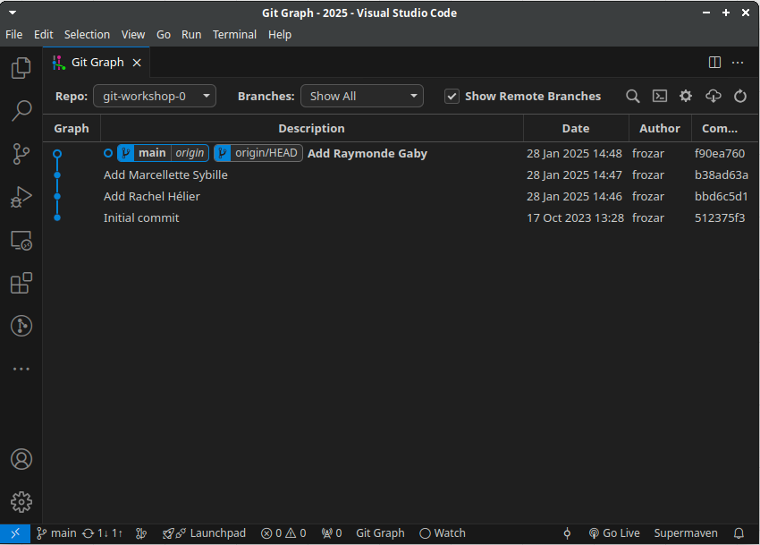
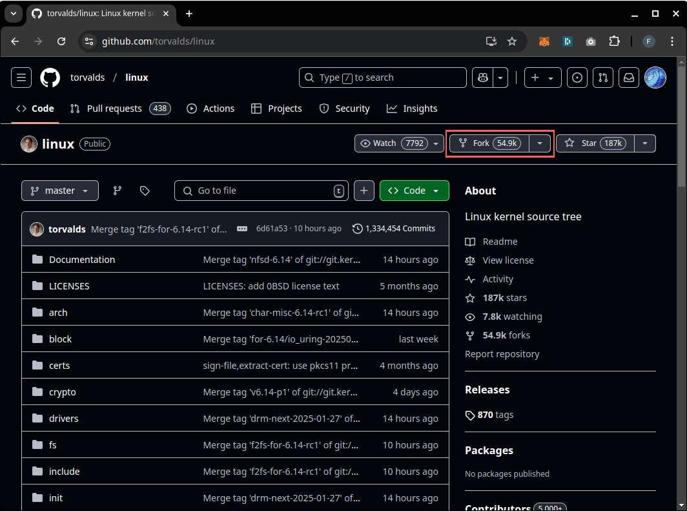
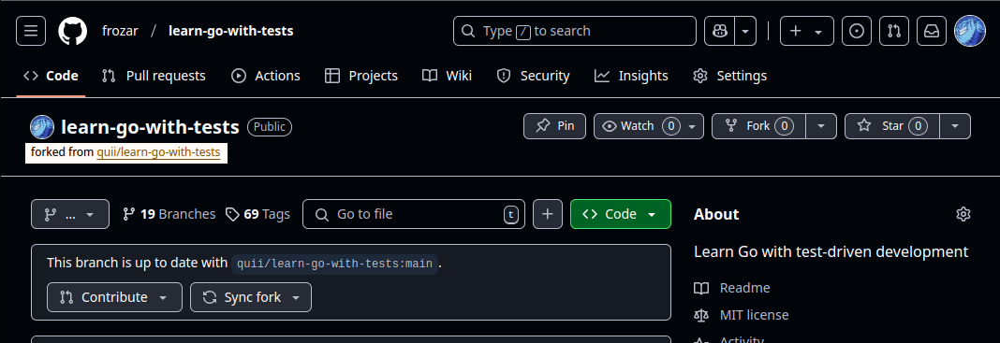
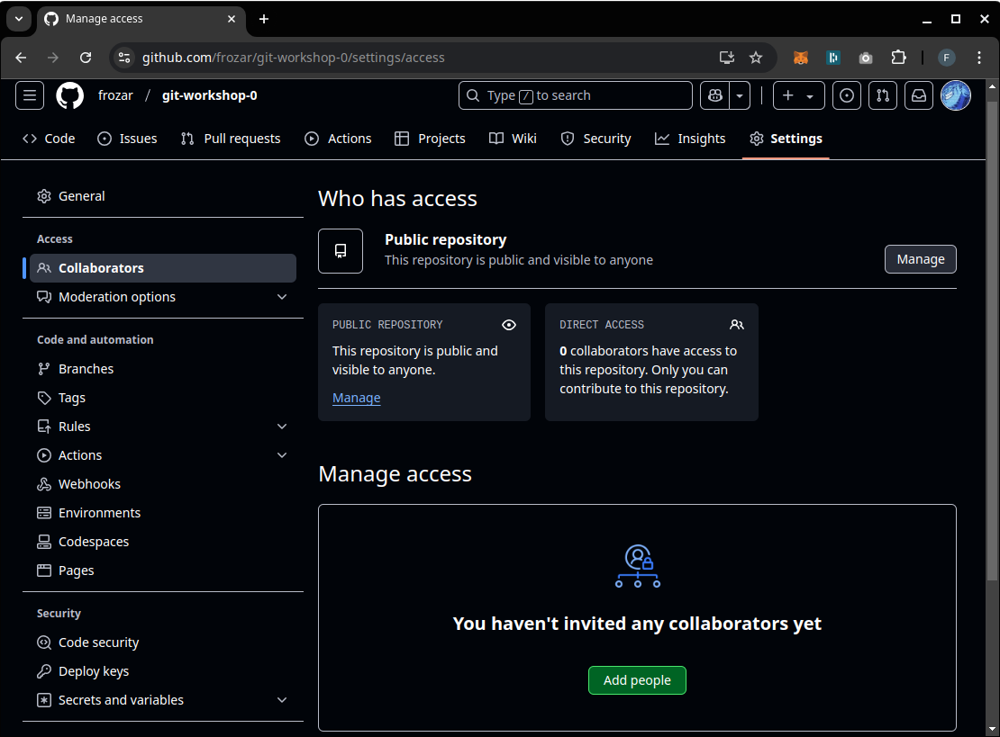
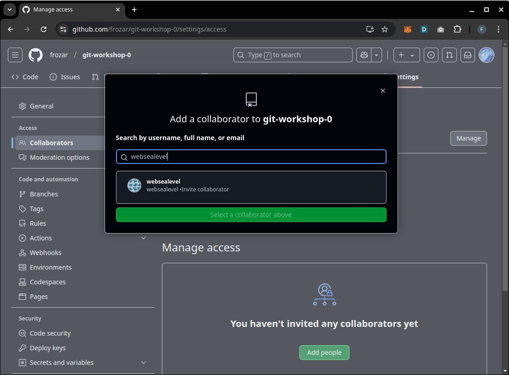
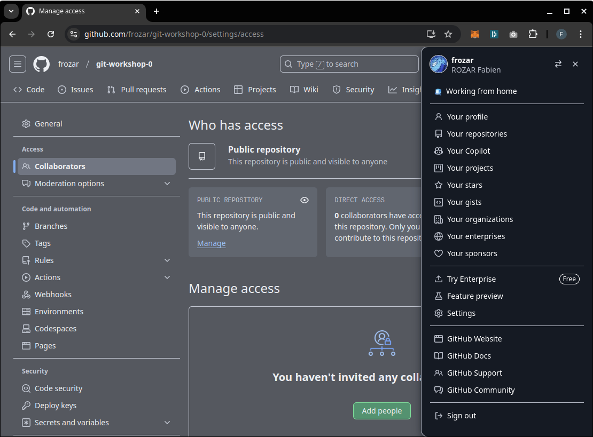

# Consigne

**Objectif** : travailler à plusieurs sur un dépôt Github avec un premier workflow.

Instructions
 - 1 personne du groupe fork ce dépôt principal
 - la personne qui crée le fork doit ajouter ces collègues comme collaborateur du dépôt
 - les collaborateurs récupèrent le dépôt forké
 - le travail est à réaliser en utilisant uniquement la branche principale `main`
 - à tour de rôle :
   1. 1 collaborateur va ajouter son prénom/nom à la liste des auteurs dans le fichier `authors.txt` dans un commit
   2. après avoir commité sa contribution, le collaborateur doit propager sa contribution sur le dépôt distant
   3. les collaborateurs qui n'ont pas fait la propagation doivent mettre à jour leur branche `main` locale avant de faire leur contribution, reprendre l'étape `i.`
 - à la fin de l'activité, le dépôt du groupe devrait avoir :
   - un historique linéaire de commit
   - une seule branche principale

Pour se faire, vous aurez besoin :
 - d'ajouter vos collègues comme contributeur sur le dépôt de votre groupe
 - d'utiliser les commandes git suivante :
   - **clone** : récupérer d'un dépôt distant
   - **status** : inspecter l'état d'un dépôt
   - **add** : mettre vos modification dans le STAGE (la salle d'attente)
   - **diff** : inspecter les modifications sur un fichier
   - **commit** : finaliser la construction d'un commit : vide le STAGE
   - **push** : pousser une branche sur un dépôt distant
   - **pull** : mettre à jour une branche locale par rapport à un dépôt distant

Lisez les sections de la "Boite à outils" pour réaliser cet exercice.

## Dans l'historique de commits

A la fin de l'exercice, vous devriez avoir un historique de commits linéaire comme
illustré ci-dessous :

Dans cet historique, il n'y a pas de merges ou de divergences.  
Tous les commits ont un seul parent (ou pas de parent pour le commit initial).

Visualisez les changements de l'historique des commits après chaque commande git.

## Bilan

Vous savez maintenant travailler à plusieurs sur un dépôt GitHub sur la branche principale.

**Remarque 1** : l'historique de commits est simple à lire. C'est simple de
savoir à un commit donné quel est l'état du dépôt. Dans notre cas, quels sont
les noms présents dans le fichier `authors.txt`.

**Remarque 2** : dans ce workflow, les collaborateurs s'attendent à tour de rôle
pour pouvoir ajouter leur nom à la liste des auteurs. Ces points de synchronisations
ralentissent le développement.

# Boite à outils

## Forker un dépôt

Pour forker un dépôt, vous devez :
 - aller sur la page d'accueil du dépôt
 - cliquer sur le bouton "Fork"

A la suite du fork, vous aurez un nouveau dépôt associé à votre compte GitHub.
Sur ce dépôt, vous pouvez voir son lien de parenthé avec le dépôt d'origine
sur la page d'accueil.

## Ajouter un collaborateur à un dépôt

Ajouter un collaborateur à un dépôt GitHub lui permet de contribuer sur un dépôt,
comme par exemple la création de branches, de Pull Requests, de pousser des commits...

Pour ajouter un collaborateur à un dépôt, vous :
 - allez sur la page Github du dépôt
 - cliquez sur le bouton "Settings"
 - allez sur la partie "Collaborators"
 - cliquez sur le bouton "Add people"
 - entrez le pseudonyme Github du collaborateur ou son pseudonyme 
 - cliquez sur le collaborateur

La page d'ajout de collateurs :

Exemple de popup d'ajout d'un collateur : 

Pour retrouver votre pseudonyme Github, cliquez sur votre avatar en haut à droite 
de la page. En haut du menu latéral, vous trouverez votre pseudonyme.

Dans le cadre de cette illustration, le pseudonyme est `frozar` :

## Comment mettre à jour une branche distante ?

Si vous souhaitez mettre à jour la branche `main` distante, parce que votre branche
`main` locale a avancé :
 - placez vous sur votre branche `main` locale : `git switch main`
 - pousser vos modifications  : `git push`

## Comment mettre à jour une branche locale ?

Si vous souhaitez mettre à jour la branche `main` locale, parce que vous voulez 
récupérer les dernières modifications :
 - placez vous sur votre branche `main` locale : `git switch main`
 - récupérer les dernières modifications  : `git pull`

**Nota Bene** : la commande `git pull` est un enchainement de `git fetch` et `git merge`.  
Pour mettre à jour votre branche `main` local par rapport à la branche `main` distante,
vous pouvez utiliser les commandes git suivantes :
 - placez vous sur la branche `main` : `git switch main`
 - mettre à jour les références locales des branches distantes : `git fetch`
 - mettre à jour la branch `main` par rapport aux changements fraichement récupérés : `git merge origin/main`

**Remarque** : si vous souhaitez uniquement savoir s'il y a eu des évolutions sur le
dépôt distant sans mettre à jour de branches locales, vous pouvez utiliser la commande
`git fetch`. Cela mettra à jour vos références locales de branches distantes. S'il y a
eu des mises à jour, vous verrez vos références locales avec les étiquettes 
`origin/<nom-de-branche>` évoluées dans le git-graph.

## Le markdown

Le markdown est un langage de balisage simple qui permet de mettre en forme du texte.
L'extension des fichiers markdown est `.md`. Ce format est souvent utilisé pour écrire 
de la documentation. C'est le format de ce fichier `README.md`.

Github interprête le markdown et l'affiche sur la page d'accueil d'un dépôt.

Si vous souhaitez vous familiariser avec le markdown, vous pouvez consulter 
cette [documentation de Github](https://docs.github.com/en/get-started/writing-on-github/getting-started-with-writing-and-formatting-on-github/basic-writing-and-formatting-syntax).

